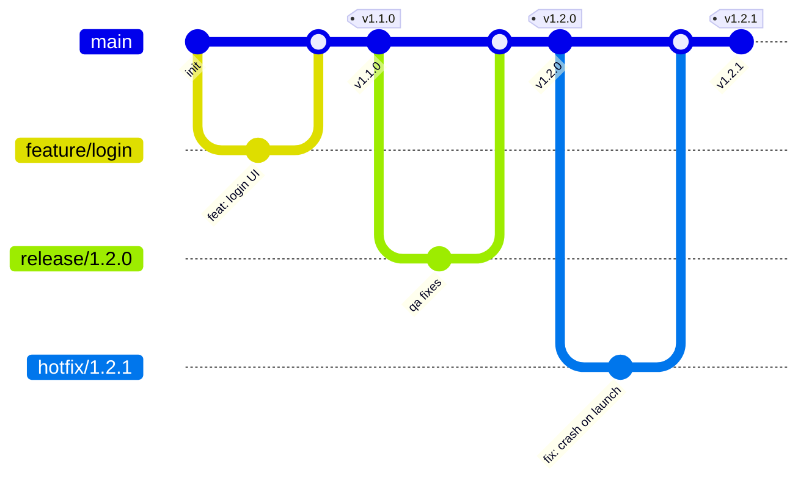

# 分支与版本管理规范（单人 Android 项目通用）

> 适用：你（独立开发者）维护的所有 Android 项目。原则：**主干始终可发布 + 标签即发布 + 短命功能分支 + 跨项目统一约定**。
> 本规范在 git-helper 中落地，其他项目直接套用即可。

---

## 1. 核心原则

1. **`main` 是唯一主干，且永远处于"可发布"状态**。任何合并进 `main` 的代码都必须能通过 CI（lint + 单测 + 一次 release 构建冒烟）。
2. **标签即发布真相源**。打 `vX.Y.Z` 标签 = 触发发布，不靠手动点按钮。
3. **功能在短命分支上开发**，绝不长期挂在 `feature/*` 上；合并后即删。
4. **跨项目零差异**：分支命名、提交格式、tag/versionCode 机制、CI 模板全部一致，新项目初始化即可用。

---

## 2. 分支模型



| 分支 | 用途 | 来源 | 合并回 | 生命周期 | 是否保护 |
|------|------|------|--------|----------|----------|
| `main` | 可发布主干 | — | — | 永久 | 是（禁 force、CI 必过） |
| `feature/<名>` | 新功能 / 较大改动 | `main` | `main` | 几小时~几天 | 否 |
| `fix/<名>` | Bug 修复（小） | `main` | `main` | 同上 | 否 |
| `release/<版本>` | 发版前稳定 / 灰度 | `main` | `main` | 发版窗口内 | 否 |
| `hotfix/<版本>` | 线上紧急修复 | 对应 `v*` 标签 | `main` | 修完即合 | 否 |

---

## 3. 分支命名规范

- 功能：`feature/dark-mode`、`feature/login`
- 修复：`fix/null-crash`、`fix/oom-on-list`
- 发版：`release/1.3.0`
- 热修：`hotfix/1.2.1`（版本号 = 出问题的版本，patch +1）

---

## 4. 提交信息规范（Conventional Commits）

所有提交遵循：

```
<type>(<scope>): <subject>
```

常用 `type`：`feat` / `fix` / `refactor` / `perf` / `docs` / `test` / `ci` / `build` / `chore`。

- 好处：可自动生成 CHANGELOG 与发版说明；CI 可据此过滤。
- 示例：`feat(login): 支持手机号一键登录`、`fix: 修复启动崩溃 (#42)`。

---

## 5. 版本与标签

- **SemVer**：`主版本.次版本.修订`（`1.3.0`）。
- **标签用 annotated tag**（带说明，可溯源）：

  ```bash
  git tag -a v1.3.0 -m "v1.3.0: 深色模式 + 启动崩溃修复"
  git push origin v1.3.0
  ```

- 推送 `v*` 标签 → 触发 release CI：构建 AAB/APK、自动 `bump versionCode` 并回写 `version.properties`、提交回 `main`。
- `versionName` 由 tag 名（去掉 `v`）决定；`versionCode` 单调递增，由 `computeVersionCode()` 解析（CI env > `version.properties` > git commit count），**不要手改**。

---

## 6. 发布流程

```bash
git switch main && git pull --ff-only
# 确保 main 绿、功能已合并
git tag -a v1.3.0 -m "v1.3.0: ..."
git push origin v1.3.0      # 触发 .github/workflows/release.yml → 调 android-release.yml
```

如需先灰度 / 稳定：从 `main` 切 `release/1.3.0` → QA → 打 `v1.3.0` 标签 → 合并回 `main`。

---

## 7. 热修流程（线上紧急崩溃）

```bash
git switch -c hotfix/1.2.1 v1.2.0   # 从出问题的 tag 切出
# 修复并提交（fix: ...）
git tag -a v1.2.1 -m "v1.2.1: 修复启动崩溃"
git push origin v1.2.1              # 立即发布
git switch main && git merge hotfix/1.2.1 && git push
```

---

## 8. 分支保护与 CI

### 8.1 职责拆分（关键认知）

**发布 CI 和 PR 校验是两件事，必须拆成两个工作流**：

- `ci.yml`（`on: pull_request` + `push: branches:[main]`）—— 合入前校验，只跑 `lintDebug` + `testDebugUnitTest` + `assembleDebug` 冒烟，**不碰签名/打包**。
- `release.yml`（`on: push: tags` + `workflow_dispatch`）→ 调 `android-release.yml`—— 只在**打 tag 时**构建 + 签名 + 打包 + 回写 `versionCode`。

> 发布工作流回写 `main` 的提交带 `[skip ci]`，会被 `ci.yml` 跳过，**不会死循环**。

### 8.2 main 分支保护规则（GitHub：Settings → Branches → Add rule，pattern 填 `main`）

| 选项 | 单人推荐 | 说明 |
|------|----------|------|
| Require a pull request before merging | ⚠️ **建议不勾** | 勾了会**同时挡住 release 工作流回写 main 的直推**，发布直接断；若坚持勾，必须把发布身份（`github-actions` 应用 / 专用 PAT）加入下方 bypass 名单 |
| Require status checks to pass | ✅ 勾 | 勾选 `verify`（`ci.yml` 的 job 名）作为必需检查 |
| Do not allow force pushes | ✅ 勾 | 关键，禁止强推 |
| Do not allow bypassing the above | 视情况 | 若上面勾了 Require PR 且加了 bot bypass，此项会限制 bypass |
| Require branches up to date | 可选勾 | |
| Require approvals | ⬜ **不勾** | 没有第二 reviewer，作者自批无意义 |
| Require signed commits / linear history | 按需 | 单人一般不必 |

**一句话配置**：禁 force-push + 要求 CI 状态检查通过；**不要**强制 Require PR（避免卡死自动发布），PR 仅作为你自己的可见性记录。

**命令行配置**（需本地装有 `gh`，把 `<owner>` 换成你的用户名）：

```bash
gh api repos/<owner>/git-helper/branches/main/protection \
  -X PUT -f required_status_checks.strict=true \
  -f "required_status_checks.contexts[]=verify" \
  -f enforce_admins=false -f required_pull_request_reviews=null \
  -f allow_force_pushes=false -f allow_deletions=false
```

### 8.3 其他 CI / 安全约定

- `ci.yml` 至少包含：`lint` + 单元测试 + 一次 `assembleRelease`/`assembleDebug` 冒烟；合并进 `main` 前就拦住问题。
- 发布 CI 与签名相关文件（`local.properties`、`app/release.keystore`、`signing.properties`）一律 gitignore，仅 `version.properties` 纳入版本管理。
- 历史欠账多导致 `lintDebug` 一上来就红时，临时注释掉 `ci.yml` 里 Lint 那一步即可，不影响发布。

---

## 9. 跨项目复用 release 模板

发布逻辑集中在 **git-helper 的 `.github/workflows/android-release.yml`（可复用工作流）**，各项目无需各自维护一份。

**本仓库**（git-helper）：`release.yml` 用本地引用调用：

```yaml
jobs:
  release:
    uses: ./.github/workflows/android-release.yml
    secrets: inherit
    with:
      version-name: >-
        ${{ github.ref_type == 'tag' && substring(github.ref_name, 1)
            || inputs.versionName }}
```

**其他项目**：复制同样的 `release.yml`，把 `uses` 改成跨仓库引用，并配置好仓库 Secrets：

```yaml
jobs:
  release:
    uses: dalan-zone/git-helper/.github/workflows/android-release.yml@main
    secrets: inherit
    with:
      version-name: >-
        ${{ github.ref_type == 'tag' && substring(github.ref_name, 1)
            || inputs.versionName }}
      # 可选覆盖：flavor / module / jdk-version / build-aab / build-apk / package-name
```

各项目需设置的 Secrets：`KEYSTORE_BASE64`、`KEYSTORE_PASSWORD`、`KEY_ALIAS`、`KEY_PASSWORD`（Play 发布另需 `PLAY_SERVICE_ACCOUNT_JSON`）。
各项目需约定的文件：`version.properties`（`VERSION_CODE=<int>`）、`gradle.properties`（`VERSION_NAME=<string>`）。

---

## 10. 推荐 git alias（一行命令走完整套流程）

配置到**全局** `~/.gitconfig`（所有项目通用）：

```ini
[alias]
  feat    = "!f() { git switch -c \"feature/$1\" main; }; f"
  fix     = "!f() { git switch -c \"fix/$1\" main; }; f"
  hotfix  = "!f() { [ -z \"$2\" ] && { echo \"usage: git hotfix <version> <base-tag>  e.g. git hotfix 1.2.1 v1.2.0\"; return 1; }; git switch -c \"hotfix/$1\" \"$2\"; }; f"
  sync    = "!git switch main && git merge --ff-only origin/main"
  publish = "!git push -u origin HEAD"
  # 发布（混合安全版）：
  #  - 第 2 个参数为 tag 说明；省略时默认用 "v<版本>"
  #  - 若当前有未提交改动，自动 stash，发完回到原分支再 stash pop
  #  - 始终基于干净 main 打 tag，绝不把未合并代码发版
  release = "!f() { v=\"$1\"; m=\"${2:-v$1}\"; b=$(git symbolic-ref --short HEAD 2>/dev/null); dirty=0; git diff --quiet && git diff --cached --quiet || dirty=1; if [ \"$dirty\" -eq 1 ]; then git stash push -u -m \"release-wip-$v\" >/dev/null 2>&1 || dirty=0; fi; if git switch main 2>/dev/null; then git pull --ff-only && git tag -a \"v$v\" -m \"$m\" && git push origin \"v$v\"; code=$?; else echo \"cannot switch to main, please stash/commit first\"; code=1; fi; if [ \"$b\" != \"main\" ]; then git switch \"$b\" >/dev/null 2>&1; fi; if [ \"$dirty\" -eq 1 ]; then git stash pop >/dev/null 2>&1 || echo \"stash not auto-restored, run: git stash pop\"; fi; return $code; }; f"
```

用法：

```bash
git feat dark-mode            # → feature/dark-mode（从 main 切出）
git fix null-crash           # → fix/null-crash
git sync                     # 拉取并快进 main
git publish                  # 推送功能分支到远端（开 PR）
git release 1.3.0 "深色模式上线，修复启动崩溃"   # 打 v1.3.0（带说明）并触发发布
git hotfix 1.2.1 v1.2.0     # 从 v1.2.0 切出 hotfix/1.2.1
```

> 以上 alias 已写入**全局** `~/.gitconfig`（对所有项目生效）。如需移除：`git config --global --unset alias.release` 等。

---

## 11. 日常命令速查

| 动作 | 命令 |
|------|------|
| 开功能 | `git feat <名>` |
| 开修复 | `git fix <名>` |
| 推送分支开 PR | `git publish` |
| 同步主干 | `git sync` |
| 发版 | `git release <x.y.z>` |
| 热修 | `git hotfix <x.y.z> <base-tag>` |
| 看当前版本号 | `cat version.properties` |
